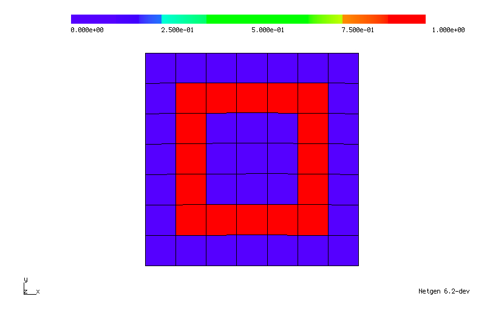
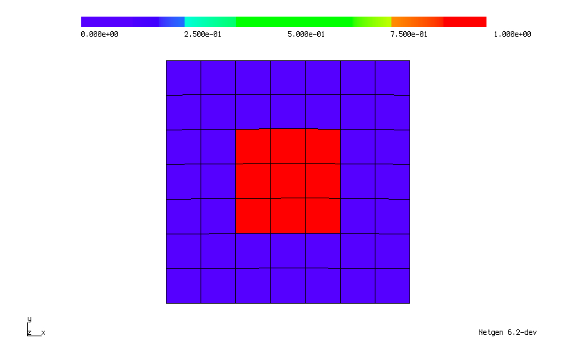
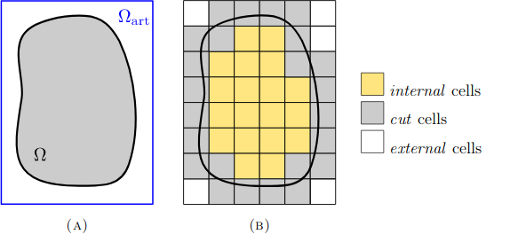

Implementation
==============
Starting form the H1 space, the algorithm eliminates from this space all the potentially problematic DOFs by introducing a set of judiciously defined constraints. These constraints are introduced using information provided by mapping exterior verticies to close inner cells, without altering the conformity of the original FE space. Alternatively, the method can be understood as an extension operator from the interior (well-posed) FE space that only involves interior cells to a larger FE space that includes cut cells and covers the whole physical domain.

The first step of the method is to build a computational mesh on the artificial domain :math:`Ω_{art}` such that it has simple geometry that is easy to mesh using Cartesian grids and it includes our physical domain :math:`Ω\subset Ω_{art}`. As we create the mesh, some of the or cells are cut in the boundary of the physical domain. These are noted as cut cells: :py:func:`ci.GetElementsOfType(IF)`, while the cells outside of the physical domain are given by :py:func:`ci.GetElementsOfType(POS)` and these inside the physical domain from :py:func:`ci.GetElementsOfType(NEG)`. The first three pictures show an example of the 3 different cell properties on the level set:

lvlset = :math:`\sqrt{ \sqrt{x^4+y^4} -1}`
which defines :math:`Ω` by: :math:`Ω = \{ x \in Ω_{art} | \text{lvlset}(x) < 0 \}` 
The following images show the cut, inside and outside cells respectively:

|cut_cells| |inner_cells| |outside_cells|

The following figures show another example of a physical domain :math:`Ω` inside :math:`Ω_{art}(A)`, and the internal, cut and external cells summarized (B).

|incutex|

