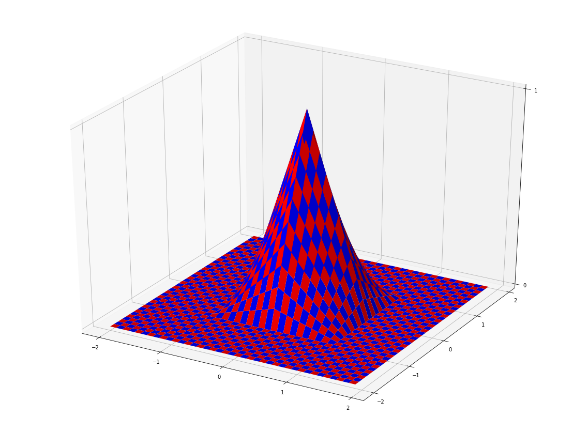
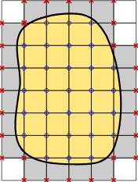
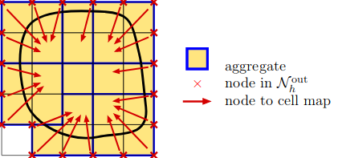

Given a grid on an artificial domain, the :math:`H^1` space on the grid is defined as the function space spanned by all functions of the following type:

Let :math:`z_{i,j} = (x_i, y_j)` denote the vertices of our grid. Let h be the height (which is for now assumed to be the same as the width) of each sqare in our grid :math:`(h = x_{i + 1, j} - x_{i, j})` for each i, j. We define 

:math:`\phi_{i, j}(x, y) = \begin{cases}
(x-x_{i-1}) (y-y_{j-1}) /h^2 &\quad\ (x, y)\in [x_{i-1},x_i] \times [y_{j-1},y_j]\\
(x-x_{i-1}) (y_{j+1}-y) /h^2 &\quad\ (x, y)\in [x_{i-1},x_i] \times [y_j,y_{j+1}]\\
(x_{i+1}-x) (y-y_{j-1}) /h^2 &\quad\ (x, y)\in [x_i,x_{i+1}] \times [y_{j-1},y_j]\\
(x_{i+1}-x) (y_{j+1}-y) /h^2 &\quad\ (x, y)\in [x_i,x_{i+1}] \times [y_j,y_{j+1}]\\
0 &\quad\ \text{otherwise}
\end{cases}`

then those :math:`\phi_{i, j}` are the basis functions of our :math:`H^1` space and each of them is associated to the vertex :math:`z_{i,j}` in the obvious way. As each of the basis functions is 0 on all other vertices and 1 on the vertex associated to it, we have for each function :math:`u` in our :math:`H^1` space:
:math:`u(z) = \sum_{i, j}^{N+1} u(z_{i, j}) \phi_{i, j}(z)`.

The following image shows such a function :math:`\phi_{i, j}` associated to a vertex at (0,0) when :math:`h` is 1:

|basisfunction|

By classifying our degrees of freedom in 3 types: inner, exterior and unused the vector describing out trial functions has the form:

:math:`u = (u^{in}, u^{ext}, u^{unused})`,

|active|

where :math:`u^{in}` corresponds to the degrees of freedom associated to the inner vertices, :math:`u^{ext}` to the vertices adjacent to a cut cell but not an inner cell, and :math:`u^{unused}` the rest of the vertices. The algorithms now restricts our solutions to those where :math:`u^{ext}` is of the form :math:`u^{ext} = T u^{in}`, where :math:`T` is linear. More specifically for each exterior degree of freedom we selected a close inner cell (using the base cell of the clustering), and define :math:`u_i` to be the value of the continuation of the function in the cell given the values of the function on the corners of that interior cell.

|Nodetocell|

where :math:`N^{out}_h` are the outer nodes.

In conclusion, we reduce the problem :math:`Au = b`, by imposing restriction to the solution given by what is given in the paper resulting in:

:math:`{\tilde{C^T}}A \tilde{C} = \tilde{C^T} b`, where :math:`\tilde{C} = (I, T, 0)^T`, with :math:`T` being the matrix that maps the degress of freedom in N\ :sup:`in` to the degress of freedom of N\ :sup:`out`. Generating the Matrix :math:`C` is the aim of the algorithm and the file :py:mod:`last_step` implements a method that returns the coefficients of the matrix :math:`\tilde{C}` given by index to value pairs (all other coefficients will be 0). The implementation of this method is different depending on whether we have a grid or or a mesh consisting of simplicies.

Result and Outlook
=================

In the notebook square_test we tested the algorithm using a simple poisson equation on a circular physical domain on a `N \times N` square Grid and compared the results of this new method to the results of the old method, the results are shown in the following table:

===  =========  ===========  =========  ==========
  N  Error Old  Cond Old     Error New  Cond New
===  =========  ===========  =========  ==========
  8  0.041436   3.9 * 10^7   0.096531   1.8 * 10^3
 10  0.026746   2.7 * 10^8   0.080747   5.8 * 10^3
 15  0.012055   1.1 * 10^4   0.032030   1.3 * 10^4
 20  0.006842   1.0 * 10^9   0.014049   2.9 * 10^4
 30  0.003062   1.1 * 10^9   0.005649   9.6 * 10^4
100  0.000278   1.4 * 10^14  0.000363   1.3 * 10^6
===  =========  ===========  =========  ==========

The new method in the tested case above had an error which was between 2 and 3 times larger than the old method but has a much better and well behaved condition number.

A possible next step would be to make sure the algorithm also for 3D meshes, we tried to write it in a way to be as compatible as possible to the 3D case, but it was not tested.

Another possible thing to do could be to check whether the algorithm could be extended to other function spaces than to H1 of order 1.

