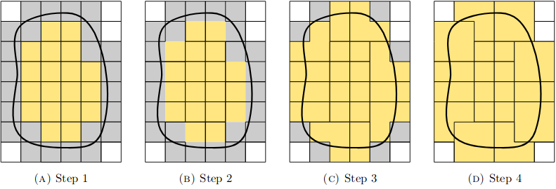

.. Practical Course documentation master file, created by
   sphinx-quickstart on Wed Jan 16 15:54:45 2019.
   You can adapt this file completely to your liking, but it should at least
   contain the root `toctree` directive.

Aggregated Unfitted FEM's documentation!
========================================

.. toctree::
   :maxdepth: 2
   :caption: Contents:

.. include:: Motivation.rst

.. include:: First_step.rst

.. include:: Second_step.rst

.. include:: Third_step.rst

The `ad_info` module
--------------------

.. automodule:: ad_info
   :members:
   :member-order: bysource

The `cluster_info` module
-------------------------

.. automodule:: cluster_info
   :members:
   :member-order: bysource

The `last_step` module
----------------------

.. automodule:: last_step
   :members:
   :member-order: bysource

.. include:: notebooks.rst

.. include:: literature.rst

Indices and tables
==================

* :ref:`genindex`
* :ref:`modindex`
* :ref:`search`
